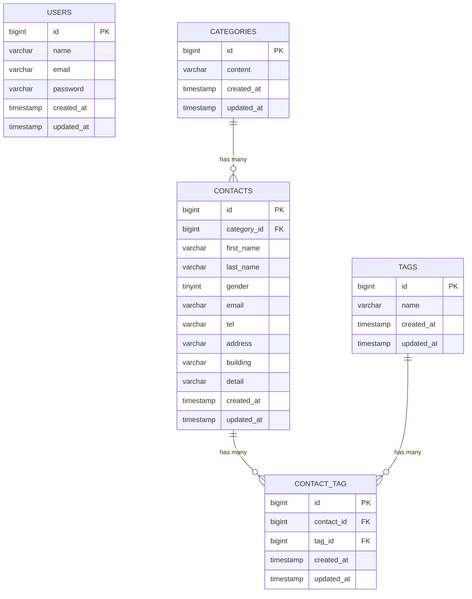

# contact-form-app

## 概要

COACHTECH 確認テスト「新お問い合わせフォーム」で作成したLaravelアプリケーションです。

一般ユーザー向けのお問い合わせフォームと、管理ユーザー向けのお問い合わせ管理画面を実装しています。  
お問い合わせ内容の確認・登録、検索、詳細表示、削除、タグ管理、CSVエクスポート、REST APIなどの機能を備えています。

## ER図



## 環境構築

### 1. リポジトリをクローン

```bash
git clone <repository-url>
cd contact-form-app
```

### 2. 環境変数ファイルを作成

```bash
cp .env.example .env
```

必要に応じて `.env` のデータベース設定を変更してください。

### 3. Composerパッケージをインストール

```bash
docker run --rm \
    -u "$(id -u):$(id -g)" \
    -v "$(pwd):/var/www/html" \
    -w /var/www/html \
    laravelsail/php82-composer:latest \
    composer install --ignore-platform-reqs
```

### 4. Laravel Sailを起動

```bash
./vendor/bin/sail up -d
```

`sail` のエイリアスを設定している場合は以下でも実行できます。

```bash
sail up -d
```

### 5. アプリケーションキーを生成

```bash
sail artisan key:generate
```

### 6. マイグレーションとSeederを実行

```bash
sail artisan migrate:fresh --seed
```

Seeder実行後、以下のデータが作成されます。

- User：1件
- Category：5件
- Tag：5件
- Contact：20件
- ContactごとにTagを1〜3件関連付け

### 7. フロントエンド依存パッケージをインストール

```bash
sail npm install
```

### 8. Viteを起動

```bash
sail npm run dev
```

## 使用技術

- PHP 8.x
- Laravel 10.x
- MySQL 8.x
- Laravel Sail
- Docker / Docker Compose
- Laravel Fortify
- Blade
- Eloquent ORM
- FormRequest
- Laravel API Resource
- PHPUnit
- Laravel Pint
- Vite
- Tailwind CSS

## APIエンドポイント一覧

公開APIとして、以下のお問い合わせCRUDを実装しています。

| Method | URL                          | 内容             |
| ------ | ---------------------------- | ---------------- |
| GET    | `/api/v1/contacts`           | お問い合わせ一覧 |
| GET    | `/api/v1/contacts/{contact}` | お問い合わせ詳細 |
| POST   | `/api/v1/contacts`           | お問い合わせ登録 |
| PUT    | `/api/v1/contacts/{contact}` | お問い合わせ更新 |
| DELETE | `/api/v1/contacts/{contact}` | お問い合わせ削除 |

一覧APIでは以下の検索条件を利用できます。

- `keyword`
- `gender`
- `category_id`
- `date`
- `page`
- `per_page`

## 開発環境URL

### お問い合わせフォーム入力ページ

http://localhost にアクセス

### ログイン画面

http://localhost/login にアクセス

### 管理画面

http://localhost/admin にアクセス

## 学んだこと

- FormRequestを利用して、Web画面・管理画面・APIごとにバリデーション処理を分離する方法
- Eloquentの `hasMany`、`belongsTo`、`belongsToMany` を利用したリレーション設計
- 多対多リレーションにおける `attach`、`sync` と中間テーブルの扱い
- Laravel Fortifyを利用した認証機能の実装
- 検索条件を組み合わせたEloquentクエリの構築
- API Resourceを利用したJSONレスポンスの整形
- Unit TestとFeature Testを使い分けて、バリデーション・リレーション・HTTP処理を検証する方法
- Laravel Pintを利用したコードスタイルの統一

## 作成者

奥島 聖吾

```

```
